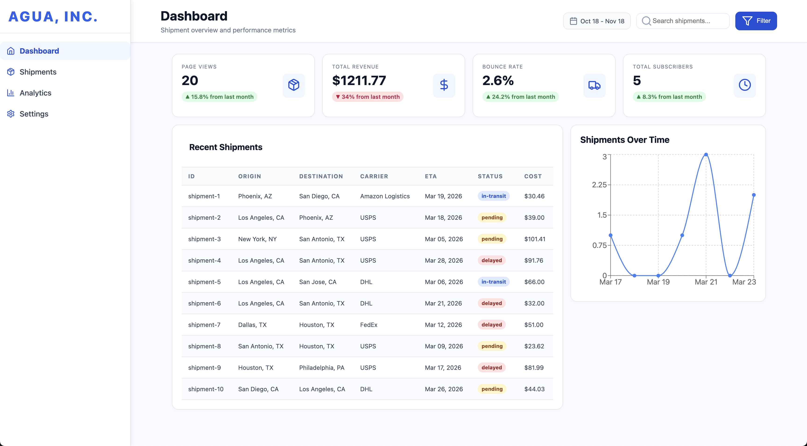

# Agua, Inc. - Shipments and Transit Dashboard

A responsive dashboard for Agua employees to track and view shipments data.



## Features

- **Real-time Updates**: Dashboard updates every 5 seconds with simulated live data
- **Summary Cards**: Key metrics including total shipments, cost, average weight, and in-transit count
- **Shipments Table**: Detailed view of recent shipments with status indicators
- **Interactive Chart**: Visual representation of shipments over time 

## Getting Started

### Prerequisites

- Node.js (version 16 or higher)
- npm or yarn

### Installation

1. Clone the repository:
   ```bash
   git clone <repository-url>
   cd shipment-dashboard
   ```

2. Install dependencies:
   ```bash
   npm install
   ```

3. Start the development server:
   ```bash
   npm run dev
   ```

4. Open your browser and navigate to `http://localhost:5173`

### Build for Production

```bash
npm run build
```

### Preview Production Build

```bash
npm run preview
```

## Project Structure

```
src/
├── components/          # Reusable UI components
│   ├── Sidebar.tsx      # Navigation sidebar
│   ├── Header.tsx       # Top header with search
│   ├── SummaryCard.tsx  # Metric display cards
│   ├── ShipmentsTable.tsx # Data table component
│   ├── ShipmentsChart.tsx # Chart visualization
│   └── LoadingSkeleton.tsx # Loading state components
├── hooks/               # Custom React hooks
│   └── useShipments.ts  # Shipment data management
├── types/               # TypeScript type definitions
│   └── index.ts         # Shipment interfaces
├── utils/               # Utility functions
│   └── mockData.ts      # Mock data generation
├── App.tsx              # Main application component
├── main.tsx             # Application entry point
└── App.css              # Global styles with Tailwind
```

## Data Model

Each shipment includes:
- Origin and destination (city, state)
- Carrier information
- Estimated time of arrival (ETA)
- Departure date
- Item size (small/medium/large)
- Weight and cost
- Current status (pending/in-transit/delivered/delayed)

## Real-time Simulation

The dashboard reflects live updates by:
- Randomly adjusting shipment costs
- Updating ETAs
- Changing shipment statuses
- Refreshing data every 5 seconds

## Customization

The mock data generator in `src/utils/mockData.ts` can be modified to:
- Add more cities and carriers
- Adjust update frequencies
- Change data ranges
- Add new shipment properties

## Contributing

1. Fork the repository
2. Create a feature branch
3. Make your changes
4. Run tests and linting
5. Submit a pull request

## License

This project is licensed under the MIT License.
